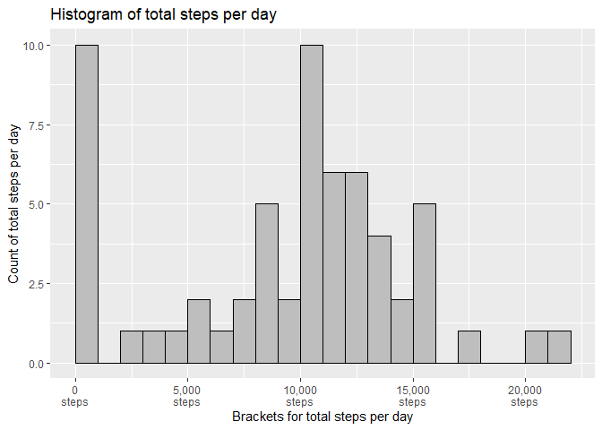
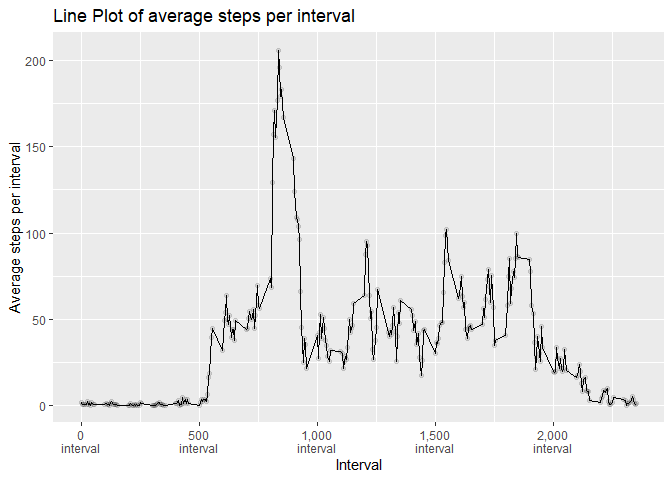
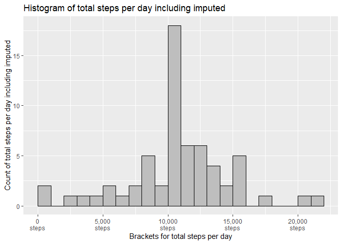
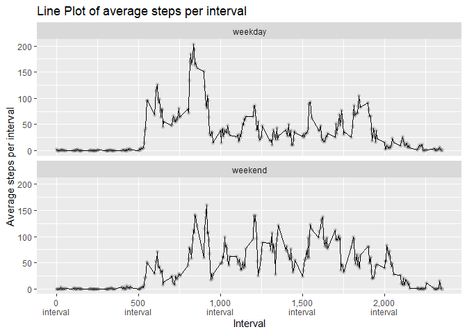

*This is the 2nd week project for Reproducible Research*


```r
knitr::opts_chunk$set(echo = TRUE, message = FALSE)
```

## Load required libraries


```r
library(tidyverse)
library(lubridate)
library(fs)
library(gt)
```


### Download the raw data


```r
# Declare our variables
data.source <- "https://d396qusza40orc.cloudfront.net/repdata%2Fdata%2Factivity.zip"
archive.name <- "repdata_data_activity.zip"
file.name <- "activity.csv"

# Get paths to zip file and csv file if available
zip.paths <- dir_ls(recurse = TRUE,
                   type = "file",
                   glob = paste0("*",archive.name))
file.paths <- dir_ls(recurse = TRUE,
                    type = "file",
                    glob = paste0("*",file.name)) 
                      
# download, unzip and read in file where valid                      
if (!length(zip.paths) && !length(file.paths)){
  download.file(data.source, archive.name, method="curl")
  unzip(archive.name)
  activity.raw <- read_csv(file = file.name)
  } else if (!length(file.paths)) {
    unzip(archive.name)
    activity.raw <- read_csv(file = file.name)
    } else if(!exists("activity.raw")) {
      activity.raw <- read_csv(file = file.name)
      } else {}
```

### Process the raw data


```r
# Change date column to a date where valid.
activity.raw$date <- ymd(activity.raw$date)
```


## What is the mean total number of steps taken per day?

1. **The total number of steps taken per day for each day.**


```r
# Group data by date and sum the steps by date
tot.steps <- activity.raw %>%
  group_by(date) %>%
  summarise(tot.steps.day = sum(steps, na.rm = TRUE))
```

2. **The Histogram of the total number of steps taken each day.**


```r
tot.steps %>%
  ggplot(aes(x = tot.steps.day)) +
  geom_histogram(binwidth = 1000,
                 boundary = 0,
                 colour = "black",
                 fill = "grey") +
  scale_x_continuous(labels = scales::label_comma(suffix = "\nsteps")) +
  labs(y = "Count of total steps per day",
       x = "Brackets for total steps per day",
       title = "Histogram of total steps per day")
```

<!-- -->

3. **The mean and median of the total number of steps taken per day**


```r
# Calculate the mean
tot.steps.mean <- tot.steps %>%
  summarise( mean.val = mean(tot.steps.day))

# Calculate the median
tot.steps %>%
  summarise(median.val = median(tot.steps.day)) %>%
  bind_cols(tot.steps.mean) %>%
  # Send values to the table
  gt() %>%
  cols_label(
    median.val = md("Median"),
    mean.val = md("Mean")
  ) %>%
  fmt_number( columns = vars(median.val, mean.val),
              decimals = 0,
              use_seps = TRUE,
              sep_mark = ",")
```

<!--html_preserve--><style>html {
  font-family: -apple-system, BlinkMacSystemFont, 'Segoe UI', Roboto, Oxygen, Ubuntu, Cantarell, 'Helvetica Neue', 'Fira Sans', 'Droid Sans', Arial, sans-serif;
}

#sopkreeoiq .gt_table {
  display: table;
  border-collapse: collapse;
  margin-left: auto;
  margin-right: auto;
  color: #333333;
  font-size: 16px;
  font-weight: normal;
  font-style: normal;
  background-color: #FFFFFF;
  width: auto;
  border-top-style: solid;
  border-top-width: 2px;
  border-top-color: #A8A8A8;
  border-right-style: none;
  border-right-width: 2px;
  border-right-color: #D3D3D3;
  border-bottom-style: solid;
  border-bottom-width: 2px;
  border-bottom-color: #A8A8A8;
  border-left-style: none;
  border-left-width: 2px;
  border-left-color: #D3D3D3;
}

#sopkreeoiq .gt_heading {
  background-color: #FFFFFF;
  text-align: center;
  border-bottom-color: #FFFFFF;
  border-left-style: none;
  border-left-width: 1px;
  border-left-color: #D3D3D3;
  border-right-style: none;
  border-right-width: 1px;
  border-right-color: #D3D3D3;
}

#sopkreeoiq .gt_title {
  color: #333333;
  font-size: 125%;
  font-weight: initial;
  padding-top: 4px;
  padding-bottom: 4px;
  border-bottom-color: #FFFFFF;
  border-bottom-width: 0;
}

#sopkreeoiq .gt_subtitle {
  color: #333333;
  font-size: 85%;
  font-weight: initial;
  padding-top: 0;
  padding-bottom: 4px;
  border-top-color: #FFFFFF;
  border-top-width: 0;
}

#sopkreeoiq .gt_bottom_border {
  border-bottom-style: solid;
  border-bottom-width: 2px;
  border-bottom-color: #D3D3D3;
}

#sopkreeoiq .gt_col_headings {
  border-top-style: solid;
  border-top-width: 2px;
  border-top-color: #D3D3D3;
  border-bottom-style: solid;
  border-bottom-width: 2px;
  border-bottom-color: #D3D3D3;
  border-left-style: none;
  border-left-width: 1px;
  border-left-color: #D3D3D3;
  border-right-style: none;
  border-right-width: 1px;
  border-right-color: #D3D3D3;
}

#sopkreeoiq .gt_col_heading {
  color: #333333;
  background-color: #FFFFFF;
  font-size: 100%;
  font-weight: normal;
  text-transform: inherit;
  border-left-style: none;
  border-left-width: 1px;
  border-left-color: #D3D3D3;
  border-right-style: none;
  border-right-width: 1px;
  border-right-color: #D3D3D3;
  vertical-align: bottom;
  padding-top: 5px;
  padding-bottom: 6px;
  padding-left: 5px;
  padding-right: 5px;
  overflow-x: hidden;
}

#sopkreeoiq .gt_column_spanner_outer {
  color: #333333;
  background-color: #FFFFFF;
  font-size: 100%;
  font-weight: normal;
  text-transform: inherit;
  padding-top: 0;
  padding-bottom: 0;
  padding-left: 4px;
  padding-right: 4px;
}

#sopkreeoiq .gt_column_spanner_outer:first-child {
  padding-left: 0;
}

#sopkreeoiq .gt_column_spanner_outer:last-child {
  padding-right: 0;
}

#sopkreeoiq .gt_column_spanner {
  border-bottom-style: solid;
  border-bottom-width: 2px;
  border-bottom-color: #D3D3D3;
  vertical-align: bottom;
  padding-top: 5px;
  padding-bottom: 6px;
  overflow-x: hidden;
  display: inline-block;
  width: 100%;
}

#sopkreeoiq .gt_group_heading {
  padding: 8px;
  color: #333333;
  background-color: #FFFFFF;
  font-size: 100%;
  font-weight: initial;
  text-transform: inherit;
  border-top-style: solid;
  border-top-width: 2px;
  border-top-color: #D3D3D3;
  border-bottom-style: solid;
  border-bottom-width: 2px;
  border-bottom-color: #D3D3D3;
  border-left-style: none;
  border-left-width: 1px;
  border-left-color: #D3D3D3;
  border-right-style: none;
  border-right-width: 1px;
  border-right-color: #D3D3D3;
  vertical-align: middle;
}

#sopkreeoiq .gt_empty_group_heading {
  padding: 0.5px;
  color: #333333;
  background-color: #FFFFFF;
  font-size: 100%;
  font-weight: initial;
  border-top-style: solid;
  border-top-width: 2px;
  border-top-color: #D3D3D3;
  border-bottom-style: solid;
  border-bottom-width: 2px;
  border-bottom-color: #D3D3D3;
  vertical-align: middle;
}

#sopkreeoiq .gt_from_md > :first-child {
  margin-top: 0;
}

#sopkreeoiq .gt_from_md > :last-child {
  margin-bottom: 0;
}

#sopkreeoiq .gt_row {
  padding-top: 8px;
  padding-bottom: 8px;
  padding-left: 5px;
  padding-right: 5px;
  margin: 10px;
  border-top-style: solid;
  border-top-width: 1px;
  border-top-color: #D3D3D3;
  border-left-style: none;
  border-left-width: 1px;
  border-left-color: #D3D3D3;
  border-right-style: none;
  border-right-width: 1px;
  border-right-color: #D3D3D3;
  vertical-align: middle;
  overflow-x: hidden;
}

#sopkreeoiq .gt_stub {
  color: #333333;
  background-color: #FFFFFF;
  font-size: 100%;
  font-weight: initial;
  text-transform: inherit;
  border-right-style: solid;
  border-right-width: 2px;
  border-right-color: #D3D3D3;
  padding-left: 12px;
}

#sopkreeoiq .gt_summary_row {
  color: #333333;
  background-color: #FFFFFF;
  text-transform: inherit;
  padding-top: 8px;
  padding-bottom: 8px;
  padding-left: 5px;
  padding-right: 5px;
}

#sopkreeoiq .gt_first_summary_row {
  padding-top: 8px;
  padding-bottom: 8px;
  padding-left: 5px;
  padding-right: 5px;
  border-top-style: solid;
  border-top-width: 2px;
  border-top-color: #D3D3D3;
}

#sopkreeoiq .gt_grand_summary_row {
  color: #333333;
  background-color: #FFFFFF;
  text-transform: inherit;
  padding-top: 8px;
  padding-bottom: 8px;
  padding-left: 5px;
  padding-right: 5px;
}

#sopkreeoiq .gt_first_grand_summary_row {
  padding-top: 8px;
  padding-bottom: 8px;
  padding-left: 5px;
  padding-right: 5px;
  border-top-style: double;
  border-top-width: 6px;
  border-top-color: #D3D3D3;
}

#sopkreeoiq .gt_striped {
  background-color: rgba(128, 128, 128, 0.05);
}

#sopkreeoiq .gt_table_body {
  border-top-style: solid;
  border-top-width: 2px;
  border-top-color: #D3D3D3;
  border-bottom-style: solid;
  border-bottom-width: 2px;
  border-bottom-color: #D3D3D3;
}

#sopkreeoiq .gt_footnotes {
  color: #333333;
  background-color: #FFFFFF;
  border-bottom-style: none;
  border-bottom-width: 2px;
  border-bottom-color: #D3D3D3;
  border-left-style: none;
  border-left-width: 2px;
  border-left-color: #D3D3D3;
  border-right-style: none;
  border-right-width: 2px;
  border-right-color: #D3D3D3;
}

#sopkreeoiq .gt_footnote {
  margin: 0px;
  font-size: 90%;
  padding: 4px;
}

#sopkreeoiq .gt_sourcenotes {
  color: #333333;
  background-color: #FFFFFF;
  border-bottom-style: none;
  border-bottom-width: 2px;
  border-bottom-color: #D3D3D3;
  border-left-style: none;
  border-left-width: 2px;
  border-left-color: #D3D3D3;
  border-right-style: none;
  border-right-width: 2px;
  border-right-color: #D3D3D3;
}

#sopkreeoiq .gt_sourcenote {
  font-size: 90%;
  padding: 4px;
}

#sopkreeoiq .gt_left {
  text-align: left;
}

#sopkreeoiq .gt_center {
  text-align: center;
}

#sopkreeoiq .gt_right {
  text-align: right;
  font-variant-numeric: tabular-nums;
}

#sopkreeoiq .gt_font_normal {
  font-weight: normal;
}

#sopkreeoiq .gt_font_bold {
  font-weight: bold;
}

#sopkreeoiq .gt_font_italic {
  font-style: italic;
}

#sopkreeoiq .gt_super {
  font-size: 65%;
}

#sopkreeoiq .gt_footnote_marks {
  font-style: italic;
  font-size: 65%;
}
</style>
<div id="sopkreeoiq" style="overflow-x:auto;overflow-y:auto;width:auto;height:auto;"><table class="gt_table">
  
  <thead class="gt_col_headings">
    <tr>
      <th class="gt_col_heading gt_columns_bottom_border gt_right" rowspan="1" colspan="1">Median</th>
      <th class="gt_col_heading gt_columns_bottom_border gt_right" rowspan="1" colspan="1">Mean</th>
    </tr>
  </thead>
  <tbody class="gt_table_body">
    <tr>
      <td class="gt_row gt_right">10,395</td>
      <td class="gt_row gt_right">9,354</td>
    </tr>
  </tbody>
  
  
</table></div><!--/html_preserve-->


## What is the average daily activity pattern?

1. **Line Plot of the time series**


```r
# Group by interval and calculate the average number of steps foor each interval
avg.steps <- activity.raw %>%
  group_by(interval) %>%
  summarise(avg.steps.int = mean(steps, na.rm = TRUE))

# Generate the line plot
avg.steps %>%
  ggplot( aes(x = interval, y = avg.steps.int) ) +
  geom_line() +
  geom_point(colour = "black", alpha = 0.1) +
  scale_x_continuous(labels = scales::label_comma(suffix = "\ninterval")) +
  labs(y = "Average steps per interval",
       x = "Interval",
       title = "Line Plot of average steps per interval")
```

<!-- -->

2. **The 5-minute interval with the maximum number of steps on average across all the days.**


```r
# Filter for the maximum average steps per interval
avg.steps %>%
  filter(avg.steps.int == max(avg.steps.int)) %>%
  # Send value to the table
  gt() %>%
  cols_label(
    avg.steps.int = md("Maximum Average Step Value "),
    interval = md("Interval with Maximum Average Step")
  ) %>%
  fmt_number( columns = vars(avg.steps.int, interval),
              decimals = 0,
              use_seps = TRUE,
              sep_mark = ",")
```

<!--html_preserve--><style>html {
  font-family: -apple-system, BlinkMacSystemFont, 'Segoe UI', Roboto, Oxygen, Ubuntu, Cantarell, 'Helvetica Neue', 'Fira Sans', 'Droid Sans', Arial, sans-serif;
}

#bnsucmkkcy .gt_table {
  display: table;
  border-collapse: collapse;
  margin-left: auto;
  margin-right: auto;
  color: #333333;
  font-size: 16px;
  font-weight: normal;
  font-style: normal;
  background-color: #FFFFFF;
  width: auto;
  border-top-style: solid;
  border-top-width: 2px;
  border-top-color: #A8A8A8;
  border-right-style: none;
  border-right-width: 2px;
  border-right-color: #D3D3D3;
  border-bottom-style: solid;
  border-bottom-width: 2px;
  border-bottom-color: #A8A8A8;
  border-left-style: none;
  border-left-width: 2px;
  border-left-color: #D3D3D3;
}

#bnsucmkkcy .gt_heading {
  background-color: #FFFFFF;
  text-align: center;
  border-bottom-color: #FFFFFF;
  border-left-style: none;
  border-left-width: 1px;
  border-left-color: #D3D3D3;
  border-right-style: none;
  border-right-width: 1px;
  border-right-color: #D3D3D3;
}

#bnsucmkkcy .gt_title {
  color: #333333;
  font-size: 125%;
  font-weight: initial;
  padding-top: 4px;
  padding-bottom: 4px;
  border-bottom-color: #FFFFFF;
  border-bottom-width: 0;
}

#bnsucmkkcy .gt_subtitle {
  color: #333333;
  font-size: 85%;
  font-weight: initial;
  padding-top: 0;
  padding-bottom: 4px;
  border-top-color: #FFFFFF;
  border-top-width: 0;
}

#bnsucmkkcy .gt_bottom_border {
  border-bottom-style: solid;
  border-bottom-width: 2px;
  border-bottom-color: #D3D3D3;
}

#bnsucmkkcy .gt_col_headings {
  border-top-style: solid;
  border-top-width: 2px;
  border-top-color: #D3D3D3;
  border-bottom-style: solid;
  border-bottom-width: 2px;
  border-bottom-color: #D3D3D3;
  border-left-style: none;
  border-left-width: 1px;
  border-left-color: #D3D3D3;
  border-right-style: none;
  border-right-width: 1px;
  border-right-color: #D3D3D3;
}

#bnsucmkkcy .gt_col_heading {
  color: #333333;
  background-color: #FFFFFF;
  font-size: 100%;
  font-weight: normal;
  text-transform: inherit;
  border-left-style: none;
  border-left-width: 1px;
  border-left-color: #D3D3D3;
  border-right-style: none;
  border-right-width: 1px;
  border-right-color: #D3D3D3;
  vertical-align: bottom;
  padding-top: 5px;
  padding-bottom: 6px;
  padding-left: 5px;
  padding-right: 5px;
  overflow-x: hidden;
}

#bnsucmkkcy .gt_column_spanner_outer {
  color: #333333;
  background-color: #FFFFFF;
  font-size: 100%;
  font-weight: normal;
  text-transform: inherit;
  padding-top: 0;
  padding-bottom: 0;
  padding-left: 4px;
  padding-right: 4px;
}

#bnsucmkkcy .gt_column_spanner_outer:first-child {
  padding-left: 0;
}

#bnsucmkkcy .gt_column_spanner_outer:last-child {
  padding-right: 0;
}

#bnsucmkkcy .gt_column_spanner {
  border-bottom-style: solid;
  border-bottom-width: 2px;
  border-bottom-color: #D3D3D3;
  vertical-align: bottom;
  padding-top: 5px;
  padding-bottom: 6px;
  overflow-x: hidden;
  display: inline-block;
  width: 100%;
}

#bnsucmkkcy .gt_group_heading {
  padding: 8px;
  color: #333333;
  background-color: #FFFFFF;
  font-size: 100%;
  font-weight: initial;
  text-transform: inherit;
  border-top-style: solid;
  border-top-width: 2px;
  border-top-color: #D3D3D3;
  border-bottom-style: solid;
  border-bottom-width: 2px;
  border-bottom-color: #D3D3D3;
  border-left-style: none;
  border-left-width: 1px;
  border-left-color: #D3D3D3;
  border-right-style: none;
  border-right-width: 1px;
  border-right-color: #D3D3D3;
  vertical-align: middle;
}

#bnsucmkkcy .gt_empty_group_heading {
  padding: 0.5px;
  color: #333333;
  background-color: #FFFFFF;
  font-size: 100%;
  font-weight: initial;
  border-top-style: solid;
  border-top-width: 2px;
  border-top-color: #D3D3D3;
  border-bottom-style: solid;
  border-bottom-width: 2px;
  border-bottom-color: #D3D3D3;
  vertical-align: middle;
}

#bnsucmkkcy .gt_from_md > :first-child {
  margin-top: 0;
}

#bnsucmkkcy .gt_from_md > :last-child {
  margin-bottom: 0;
}

#bnsucmkkcy .gt_row {
  padding-top: 8px;
  padding-bottom: 8px;
  padding-left: 5px;
  padding-right: 5px;
  margin: 10px;
  border-top-style: solid;
  border-top-width: 1px;
  border-top-color: #D3D3D3;
  border-left-style: none;
  border-left-width: 1px;
  border-left-color: #D3D3D3;
  border-right-style: none;
  border-right-width: 1px;
  border-right-color: #D3D3D3;
  vertical-align: middle;
  overflow-x: hidden;
}

#bnsucmkkcy .gt_stub {
  color: #333333;
  background-color: #FFFFFF;
  font-size: 100%;
  font-weight: initial;
  text-transform: inherit;
  border-right-style: solid;
  border-right-width: 2px;
  border-right-color: #D3D3D3;
  padding-left: 12px;
}

#bnsucmkkcy .gt_summary_row {
  color: #333333;
  background-color: #FFFFFF;
  text-transform: inherit;
  padding-top: 8px;
  padding-bottom: 8px;
  padding-left: 5px;
  padding-right: 5px;
}

#bnsucmkkcy .gt_first_summary_row {
  padding-top: 8px;
  padding-bottom: 8px;
  padding-left: 5px;
  padding-right: 5px;
  border-top-style: solid;
  border-top-width: 2px;
  border-top-color: #D3D3D3;
}

#bnsucmkkcy .gt_grand_summary_row {
  color: #333333;
  background-color: #FFFFFF;
  text-transform: inherit;
  padding-top: 8px;
  padding-bottom: 8px;
  padding-left: 5px;
  padding-right: 5px;
}

#bnsucmkkcy .gt_first_grand_summary_row {
  padding-top: 8px;
  padding-bottom: 8px;
  padding-left: 5px;
  padding-right: 5px;
  border-top-style: double;
  border-top-width: 6px;
  border-top-color: #D3D3D3;
}

#bnsucmkkcy .gt_striped {
  background-color: rgba(128, 128, 128, 0.05);
}

#bnsucmkkcy .gt_table_body {
  border-top-style: solid;
  border-top-width: 2px;
  border-top-color: #D3D3D3;
  border-bottom-style: solid;
  border-bottom-width: 2px;
  border-bottom-color: #D3D3D3;
}

#bnsucmkkcy .gt_footnotes {
  color: #333333;
  background-color: #FFFFFF;
  border-bottom-style: none;
  border-bottom-width: 2px;
  border-bottom-color: #D3D3D3;
  border-left-style: none;
  border-left-width: 2px;
  border-left-color: #D3D3D3;
  border-right-style: none;
  border-right-width: 2px;
  border-right-color: #D3D3D3;
}

#bnsucmkkcy .gt_footnote {
  margin: 0px;
  font-size: 90%;
  padding: 4px;
}

#bnsucmkkcy .gt_sourcenotes {
  color: #333333;
  background-color: #FFFFFF;
  border-bottom-style: none;
  border-bottom-width: 2px;
  border-bottom-color: #D3D3D3;
  border-left-style: none;
  border-left-width: 2px;
  border-left-color: #D3D3D3;
  border-right-style: none;
  border-right-width: 2px;
  border-right-color: #D3D3D3;
}

#bnsucmkkcy .gt_sourcenote {
  font-size: 90%;
  padding: 4px;
}

#bnsucmkkcy .gt_left {
  text-align: left;
}

#bnsucmkkcy .gt_center {
  text-align: center;
}

#bnsucmkkcy .gt_right {
  text-align: right;
  font-variant-numeric: tabular-nums;
}

#bnsucmkkcy .gt_font_normal {
  font-weight: normal;
}

#bnsucmkkcy .gt_font_bold {
  font-weight: bold;
}

#bnsucmkkcy .gt_font_italic {
  font-style: italic;
}

#bnsucmkkcy .gt_super {
  font-size: 65%;
}

#bnsucmkkcy .gt_footnote_marks {
  font-style: italic;
  font-size: 65%;
}
</style>
<div id="bnsucmkkcy" style="overflow-x:auto;overflow-y:auto;width:auto;height:auto;"><table class="gt_table">
  
  <thead class="gt_col_headings">
    <tr>
      <th class="gt_col_heading gt_columns_bottom_border gt_right" rowspan="1" colspan="1">Interval with Maximum Average Step</th>
      <th class="gt_col_heading gt_columns_bottom_border gt_right" rowspan="1" colspan="1">Maximum Average Step Value</th>
    </tr>
  </thead>
  <tbody class="gt_table_body">
    <tr>
      <td class="gt_row gt_right">835</td>
      <td class="gt_row gt_right">206</td>
    </tr>
  </tbody>
  
  
</table></div><!--/html_preserve-->


## Imputing missing values

1. **The total number of missing values in the database**


```r
# Count the number of NA's
activity.raw %>%
  summarise(na.count = sum(is.na(steps))) %>%
  gt() %>%
  cols_label(
    na.count = md("Count of NA's")
  ) %>%
  fmt_number( columns = vars(na.count),
              decimals = 0,
              use_seps = TRUE,
              sep_mark = ",")
```

<!--html_preserve--><style>html {
  font-family: -apple-system, BlinkMacSystemFont, 'Segoe UI', Roboto, Oxygen, Ubuntu, Cantarell, 'Helvetica Neue', 'Fira Sans', 'Droid Sans', Arial, sans-serif;
}

#oelcacqjor .gt_table {
  display: table;
  border-collapse: collapse;
  margin-left: auto;
  margin-right: auto;
  color: #333333;
  font-size: 16px;
  font-weight: normal;
  font-style: normal;
  background-color: #FFFFFF;
  width: auto;
  border-top-style: solid;
  border-top-width: 2px;
  border-top-color: #A8A8A8;
  border-right-style: none;
  border-right-width: 2px;
  border-right-color: #D3D3D3;
  border-bottom-style: solid;
  border-bottom-width: 2px;
  border-bottom-color: #A8A8A8;
  border-left-style: none;
  border-left-width: 2px;
  border-left-color: #D3D3D3;
}

#oelcacqjor .gt_heading {
  background-color: #FFFFFF;
  text-align: center;
  border-bottom-color: #FFFFFF;
  border-left-style: none;
  border-left-width: 1px;
  border-left-color: #D3D3D3;
  border-right-style: none;
  border-right-width: 1px;
  border-right-color: #D3D3D3;
}

#oelcacqjor .gt_title {
  color: #333333;
  font-size: 125%;
  font-weight: initial;
  padding-top: 4px;
  padding-bottom: 4px;
  border-bottom-color: #FFFFFF;
  border-bottom-width: 0;
}

#oelcacqjor .gt_subtitle {
  color: #333333;
  font-size: 85%;
  font-weight: initial;
  padding-top: 0;
  padding-bottom: 4px;
  border-top-color: #FFFFFF;
  border-top-width: 0;
}

#oelcacqjor .gt_bottom_border {
  border-bottom-style: solid;
  border-bottom-width: 2px;
  border-bottom-color: #D3D3D3;
}

#oelcacqjor .gt_col_headings {
  border-top-style: solid;
  border-top-width: 2px;
  border-top-color: #D3D3D3;
  border-bottom-style: solid;
  border-bottom-width: 2px;
  border-bottom-color: #D3D3D3;
  border-left-style: none;
  border-left-width: 1px;
  border-left-color: #D3D3D3;
  border-right-style: none;
  border-right-width: 1px;
  border-right-color: #D3D3D3;
}

#oelcacqjor .gt_col_heading {
  color: #333333;
  background-color: #FFFFFF;
  font-size: 100%;
  font-weight: normal;
  text-transform: inherit;
  border-left-style: none;
  border-left-width: 1px;
  border-left-color: #D3D3D3;
  border-right-style: none;
  border-right-width: 1px;
  border-right-color: #D3D3D3;
  vertical-align: bottom;
  padding-top: 5px;
  padding-bottom: 6px;
  padding-left: 5px;
  padding-right: 5px;
  overflow-x: hidden;
}

#oelcacqjor .gt_column_spanner_outer {
  color: #333333;
  background-color: #FFFFFF;
  font-size: 100%;
  font-weight: normal;
  text-transform: inherit;
  padding-top: 0;
  padding-bottom: 0;
  padding-left: 4px;
  padding-right: 4px;
}

#oelcacqjor .gt_column_spanner_outer:first-child {
  padding-left: 0;
}

#oelcacqjor .gt_column_spanner_outer:last-child {
  padding-right: 0;
}

#oelcacqjor .gt_column_spanner {
  border-bottom-style: solid;
  border-bottom-width: 2px;
  border-bottom-color: #D3D3D3;
  vertical-align: bottom;
  padding-top: 5px;
  padding-bottom: 6px;
  overflow-x: hidden;
  display: inline-block;
  width: 100%;
}

#oelcacqjor .gt_group_heading {
  padding: 8px;
  color: #333333;
  background-color: #FFFFFF;
  font-size: 100%;
  font-weight: initial;
  text-transform: inherit;
  border-top-style: solid;
  border-top-width: 2px;
  border-top-color: #D3D3D3;
  border-bottom-style: solid;
  border-bottom-width: 2px;
  border-bottom-color: #D3D3D3;
  border-left-style: none;
  border-left-width: 1px;
  border-left-color: #D3D3D3;
  border-right-style: none;
  border-right-width: 1px;
  border-right-color: #D3D3D3;
  vertical-align: middle;
}

#oelcacqjor .gt_empty_group_heading {
  padding: 0.5px;
  color: #333333;
  background-color: #FFFFFF;
  font-size: 100%;
  font-weight: initial;
  border-top-style: solid;
  border-top-width: 2px;
  border-top-color: #D3D3D3;
  border-bottom-style: solid;
  border-bottom-width: 2px;
  border-bottom-color: #D3D3D3;
  vertical-align: middle;
}

#oelcacqjor .gt_from_md > :first-child {
  margin-top: 0;
}

#oelcacqjor .gt_from_md > :last-child {
  margin-bottom: 0;
}

#oelcacqjor .gt_row {
  padding-top: 8px;
  padding-bottom: 8px;
  padding-left: 5px;
  padding-right: 5px;
  margin: 10px;
  border-top-style: solid;
  border-top-width: 1px;
  border-top-color: #D3D3D3;
  border-left-style: none;
  border-left-width: 1px;
  border-left-color: #D3D3D3;
  border-right-style: none;
  border-right-width: 1px;
  border-right-color: #D3D3D3;
  vertical-align: middle;
  overflow-x: hidden;
}

#oelcacqjor .gt_stub {
  color: #333333;
  background-color: #FFFFFF;
  font-size: 100%;
  font-weight: initial;
  text-transform: inherit;
  border-right-style: solid;
  border-right-width: 2px;
  border-right-color: #D3D3D3;
  padding-left: 12px;
}

#oelcacqjor .gt_summary_row {
  color: #333333;
  background-color: #FFFFFF;
  text-transform: inherit;
  padding-top: 8px;
  padding-bottom: 8px;
  padding-left: 5px;
  padding-right: 5px;
}

#oelcacqjor .gt_first_summary_row {
  padding-top: 8px;
  padding-bottom: 8px;
  padding-left: 5px;
  padding-right: 5px;
  border-top-style: solid;
  border-top-width: 2px;
  border-top-color: #D3D3D3;
}

#oelcacqjor .gt_grand_summary_row {
  color: #333333;
  background-color: #FFFFFF;
  text-transform: inherit;
  padding-top: 8px;
  padding-bottom: 8px;
  padding-left: 5px;
  padding-right: 5px;
}

#oelcacqjor .gt_first_grand_summary_row {
  padding-top: 8px;
  padding-bottom: 8px;
  padding-left: 5px;
  padding-right: 5px;
  border-top-style: double;
  border-top-width: 6px;
  border-top-color: #D3D3D3;
}

#oelcacqjor .gt_striped {
  background-color: rgba(128, 128, 128, 0.05);
}

#oelcacqjor .gt_table_body {
  border-top-style: solid;
  border-top-width: 2px;
  border-top-color: #D3D3D3;
  border-bottom-style: solid;
  border-bottom-width: 2px;
  border-bottom-color: #D3D3D3;
}

#oelcacqjor .gt_footnotes {
  color: #333333;
  background-color: #FFFFFF;
  border-bottom-style: none;
  border-bottom-width: 2px;
  border-bottom-color: #D3D3D3;
  border-left-style: none;
  border-left-width: 2px;
  border-left-color: #D3D3D3;
  border-right-style: none;
  border-right-width: 2px;
  border-right-color: #D3D3D3;
}

#oelcacqjor .gt_footnote {
  margin: 0px;
  font-size: 90%;
  padding: 4px;
}

#oelcacqjor .gt_sourcenotes {
  color: #333333;
  background-color: #FFFFFF;
  border-bottom-style: none;
  border-bottom-width: 2px;
  border-bottom-color: #D3D3D3;
  border-left-style: none;
  border-left-width: 2px;
  border-left-color: #D3D3D3;
  border-right-style: none;
  border-right-width: 2px;
  border-right-color: #D3D3D3;
}

#oelcacqjor .gt_sourcenote {
  font-size: 90%;
  padding: 4px;
}

#oelcacqjor .gt_left {
  text-align: left;
}

#oelcacqjor .gt_center {
  text-align: center;
}

#oelcacqjor .gt_right {
  text-align: right;
  font-variant-numeric: tabular-nums;
}

#oelcacqjor .gt_font_normal {
  font-weight: normal;
}

#oelcacqjor .gt_font_bold {
  font-weight: bold;
}

#oelcacqjor .gt_font_italic {
  font-style: italic;
}

#oelcacqjor .gt_super {
  font-size: 65%;
}

#oelcacqjor .gt_footnote_marks {
  font-style: italic;
  font-size: 65%;
}
</style>
<div id="oelcacqjor" style="overflow-x:auto;overflow-y:auto;width:auto;height:auto;"><table class="gt_table">
  
  <thead class="gt_col_headings">
    <tr>
      <th class="gt_col_heading gt_columns_bottom_border gt_center" rowspan="1" colspan="1">Count of NA's</th>
    </tr>
  </thead>
  <tbody class="gt_table_body">
    <tr>
      <td class="gt_row gt_center">2,304</td>
    </tr>
  </tbody>
  
  
</table></div><!--/html_preserve-->

2. **Fill in all of the missing values in the dataset.**
3. **Create a new dataset that is equal to the original dataset but with the missing data filled in**


```r
# Use tidy models to impute using k nearest neighbours to impute missing data
library(recipes)
imputed.rec <- recipe(date ~ steps + interval,
                      data = activity.raw) %>%
  step_knnimpute(steps)

imputed.activity <- prep(imputed.rec) %>%
  juice()
```

4. **Make a histogram of the total number of steps taken each day and Calculate and report the mean and median total number of steps taken per day**


```r
# Calculate total steps each day
imp.tot.steps <- imputed.activity %>%
  group_by(date) %>%
  summarise(imp.tot.steps.day = sum(steps)) %>%
  ungroup

# Plot the histogram
imp.tot.steps %>%
  ggplot(aes(x = imp.tot.steps.day)) +
  geom_histogram(binwidth = 1000,
                 boundary = 0,
                 colour = "black",
                 fill = "grey") +
  scale_x_continuous(labels = scales::label_comma(suffix = "\nsteps")) +
  labs(y = "Count of total steps per day including imputed",
       x = "Brackets for total steps per day",
       title = "Histogram of total steps per day including imputed")
```

<!-- -->

```r
imp.tot.steps.mean <- imp.tot.steps %>%
  summarise(imp.mean.val = mean(imp.tot.steps.day))

imp.tot.steps %>%
  summarise(imp.median.val = median(imp.tot.steps.day)) %>%
  bind_cols(imp.tot.steps.mean) %>%
  gt() %>%
  cols_label(
    imp.median.val = md("Imputed Median"),
    imp.mean.val = md("Imputed Mean")
  ) %>%
  fmt_number( columns = vars(imp.median.val, imp.mean.val),
              decimals = 0,
              use_seps = TRUE,
              sep_mark = ",")
```

<!--html_preserve--><style>html {
  font-family: -apple-system, BlinkMacSystemFont, 'Segoe UI', Roboto, Oxygen, Ubuntu, Cantarell, 'Helvetica Neue', 'Fira Sans', 'Droid Sans', Arial, sans-serif;
}

#dyycwsjyxg .gt_table {
  display: table;
  border-collapse: collapse;
  margin-left: auto;
  margin-right: auto;
  color: #333333;
  font-size: 16px;
  font-weight: normal;
  font-style: normal;
  background-color: #FFFFFF;
  width: auto;
  border-top-style: solid;
  border-top-width: 2px;
  border-top-color: #A8A8A8;
  border-right-style: none;
  border-right-width: 2px;
  border-right-color: #D3D3D3;
  border-bottom-style: solid;
  border-bottom-width: 2px;
  border-bottom-color: #A8A8A8;
  border-left-style: none;
  border-left-width: 2px;
  border-left-color: #D3D3D3;
}

#dyycwsjyxg .gt_heading {
  background-color: #FFFFFF;
  text-align: center;
  border-bottom-color: #FFFFFF;
  border-left-style: none;
  border-left-width: 1px;
  border-left-color: #D3D3D3;
  border-right-style: none;
  border-right-width: 1px;
  border-right-color: #D3D3D3;
}

#dyycwsjyxg .gt_title {
  color: #333333;
  font-size: 125%;
  font-weight: initial;
  padding-top: 4px;
  padding-bottom: 4px;
  border-bottom-color: #FFFFFF;
  border-bottom-width: 0;
}

#dyycwsjyxg .gt_subtitle {
  color: #333333;
  font-size: 85%;
  font-weight: initial;
  padding-top: 0;
  padding-bottom: 4px;
  border-top-color: #FFFFFF;
  border-top-width: 0;
}

#dyycwsjyxg .gt_bottom_border {
  border-bottom-style: solid;
  border-bottom-width: 2px;
  border-bottom-color: #D3D3D3;
}

#dyycwsjyxg .gt_col_headings {
  border-top-style: solid;
  border-top-width: 2px;
  border-top-color: #D3D3D3;
  border-bottom-style: solid;
  border-bottom-width: 2px;
  border-bottom-color: #D3D3D3;
  border-left-style: none;
  border-left-width: 1px;
  border-left-color: #D3D3D3;
  border-right-style: none;
  border-right-width: 1px;
  border-right-color: #D3D3D3;
}

#dyycwsjyxg .gt_col_heading {
  color: #333333;
  background-color: #FFFFFF;
  font-size: 100%;
  font-weight: normal;
  text-transform: inherit;
  border-left-style: none;
  border-left-width: 1px;
  border-left-color: #D3D3D3;
  border-right-style: none;
  border-right-width: 1px;
  border-right-color: #D3D3D3;
  vertical-align: bottom;
  padding-top: 5px;
  padding-bottom: 6px;
  padding-left: 5px;
  padding-right: 5px;
  overflow-x: hidden;
}

#dyycwsjyxg .gt_column_spanner_outer {
  color: #333333;
  background-color: #FFFFFF;
  font-size: 100%;
  font-weight: normal;
  text-transform: inherit;
  padding-top: 0;
  padding-bottom: 0;
  padding-left: 4px;
  padding-right: 4px;
}

#dyycwsjyxg .gt_column_spanner_outer:first-child {
  padding-left: 0;
}

#dyycwsjyxg .gt_column_spanner_outer:last-child {
  padding-right: 0;
}

#dyycwsjyxg .gt_column_spanner {
  border-bottom-style: solid;
  border-bottom-width: 2px;
  border-bottom-color: #D3D3D3;
  vertical-align: bottom;
  padding-top: 5px;
  padding-bottom: 6px;
  overflow-x: hidden;
  display: inline-block;
  width: 100%;
}

#dyycwsjyxg .gt_group_heading {
  padding: 8px;
  color: #333333;
  background-color: #FFFFFF;
  font-size: 100%;
  font-weight: initial;
  text-transform: inherit;
  border-top-style: solid;
  border-top-width: 2px;
  border-top-color: #D3D3D3;
  border-bottom-style: solid;
  border-bottom-width: 2px;
  border-bottom-color: #D3D3D3;
  border-left-style: none;
  border-left-width: 1px;
  border-left-color: #D3D3D3;
  border-right-style: none;
  border-right-width: 1px;
  border-right-color: #D3D3D3;
  vertical-align: middle;
}

#dyycwsjyxg .gt_empty_group_heading {
  padding: 0.5px;
  color: #333333;
  background-color: #FFFFFF;
  font-size: 100%;
  font-weight: initial;
  border-top-style: solid;
  border-top-width: 2px;
  border-top-color: #D3D3D3;
  border-bottom-style: solid;
  border-bottom-width: 2px;
  border-bottom-color: #D3D3D3;
  vertical-align: middle;
}

#dyycwsjyxg .gt_from_md > :first-child {
  margin-top: 0;
}

#dyycwsjyxg .gt_from_md > :last-child {
  margin-bottom: 0;
}

#dyycwsjyxg .gt_row {
  padding-top: 8px;
  padding-bottom: 8px;
  padding-left: 5px;
  padding-right: 5px;
  margin: 10px;
  border-top-style: solid;
  border-top-width: 1px;
  border-top-color: #D3D3D3;
  border-left-style: none;
  border-left-width: 1px;
  border-left-color: #D3D3D3;
  border-right-style: none;
  border-right-width: 1px;
  border-right-color: #D3D3D3;
  vertical-align: middle;
  overflow-x: hidden;
}

#dyycwsjyxg .gt_stub {
  color: #333333;
  background-color: #FFFFFF;
  font-size: 100%;
  font-weight: initial;
  text-transform: inherit;
  border-right-style: solid;
  border-right-width: 2px;
  border-right-color: #D3D3D3;
  padding-left: 12px;
}

#dyycwsjyxg .gt_summary_row {
  color: #333333;
  background-color: #FFFFFF;
  text-transform: inherit;
  padding-top: 8px;
  padding-bottom: 8px;
  padding-left: 5px;
  padding-right: 5px;
}

#dyycwsjyxg .gt_first_summary_row {
  padding-top: 8px;
  padding-bottom: 8px;
  padding-left: 5px;
  padding-right: 5px;
  border-top-style: solid;
  border-top-width: 2px;
  border-top-color: #D3D3D3;
}

#dyycwsjyxg .gt_grand_summary_row {
  color: #333333;
  background-color: #FFFFFF;
  text-transform: inherit;
  padding-top: 8px;
  padding-bottom: 8px;
  padding-left: 5px;
  padding-right: 5px;
}

#dyycwsjyxg .gt_first_grand_summary_row {
  padding-top: 8px;
  padding-bottom: 8px;
  padding-left: 5px;
  padding-right: 5px;
  border-top-style: double;
  border-top-width: 6px;
  border-top-color: #D3D3D3;
}

#dyycwsjyxg .gt_striped {
  background-color: rgba(128, 128, 128, 0.05);
}

#dyycwsjyxg .gt_table_body {
  border-top-style: solid;
  border-top-width: 2px;
  border-top-color: #D3D3D3;
  border-bottom-style: solid;
  border-bottom-width: 2px;
  border-bottom-color: #D3D3D3;
}

#dyycwsjyxg .gt_footnotes {
  color: #333333;
  background-color: #FFFFFF;
  border-bottom-style: none;
  border-bottom-width: 2px;
  border-bottom-color: #D3D3D3;
  border-left-style: none;
  border-left-width: 2px;
  border-left-color: #D3D3D3;
  border-right-style: none;
  border-right-width: 2px;
  border-right-color: #D3D3D3;
}

#dyycwsjyxg .gt_footnote {
  margin: 0px;
  font-size: 90%;
  padding: 4px;
}

#dyycwsjyxg .gt_sourcenotes {
  color: #333333;
  background-color: #FFFFFF;
  border-bottom-style: none;
  border-bottom-width: 2px;
  border-bottom-color: #D3D3D3;
  border-left-style: none;
  border-left-width: 2px;
  border-left-color: #D3D3D3;
  border-right-style: none;
  border-right-width: 2px;
  border-right-color: #D3D3D3;
}

#dyycwsjyxg .gt_sourcenote {
  font-size: 90%;
  padding: 4px;
}

#dyycwsjyxg .gt_left {
  text-align: left;
}

#dyycwsjyxg .gt_center {
  text-align: center;
}

#dyycwsjyxg .gt_right {
  text-align: right;
  font-variant-numeric: tabular-nums;
}

#dyycwsjyxg .gt_font_normal {
  font-weight: normal;
}

#dyycwsjyxg .gt_font_bold {
  font-weight: bold;
}

#dyycwsjyxg .gt_font_italic {
  font-style: italic;
}

#dyycwsjyxg .gt_super {
  font-size: 65%;
}

#dyycwsjyxg .gt_footnote_marks {
  font-style: italic;
  font-size: 65%;
}
</style>
<div id="dyycwsjyxg" style="overflow-x:auto;overflow-y:auto;width:auto;height:auto;"><table class="gt_table">
  
  <thead class="gt_col_headings">
    <tr>
      <th class="gt_col_heading gt_columns_bottom_border gt_right" rowspan="1" colspan="1">Imputed Median</th>
      <th class="gt_col_heading gt_columns_bottom_border gt_right" rowspan="1" colspan="1">Imputed Mean</th>
    </tr>
  </thead>
  <tbody class="gt_table_body">
    <tr>
      <td class="gt_row gt_right">10,774</td>
      <td class="gt_row gt_right">10,767</td>
    </tr>
  </tbody>
  
  
</table></div><!--/html_preserve-->
**Ans:** There are changes between the mean and median before and after imputation.
After imputing the mean shifted more than the median, interestingly the overall distribution shown on the histogram stayed more or less the same. 

## Are there differences in activity patterns between weekdays and weekends?


```r
imputed.activity$date <- ymd(imputed.activity$date)
imputed.activity <- imputed.activity %>% mutate( wkday.wkend = case_when(wday(date) == 1 ~ "weekend",
                                                     wday(date) == 7 ~ "weekend",
                                                     TRUE ~ "weekday"))
imputed.activity %>%
  group_by(wkday.wkend, interval) %>%
  summarise(avg.steps.int = mean(steps)) %>%
  ggplot( aes(x = interval, y = avg.steps.int) ) +
  geom_line() +
  geom_point(colour = "black", alpha = 0.1) +
  facet_wrap(~wkday.wkend, nrow = 2) +
  scale_x_continuous(labels = scales::label_comma(suffix = "\ninterval")) +
  labs(y = "Average steps per interval",
       x = "Interval",
       title = "Line Plot of average steps per interval")
```

<!-- -->


